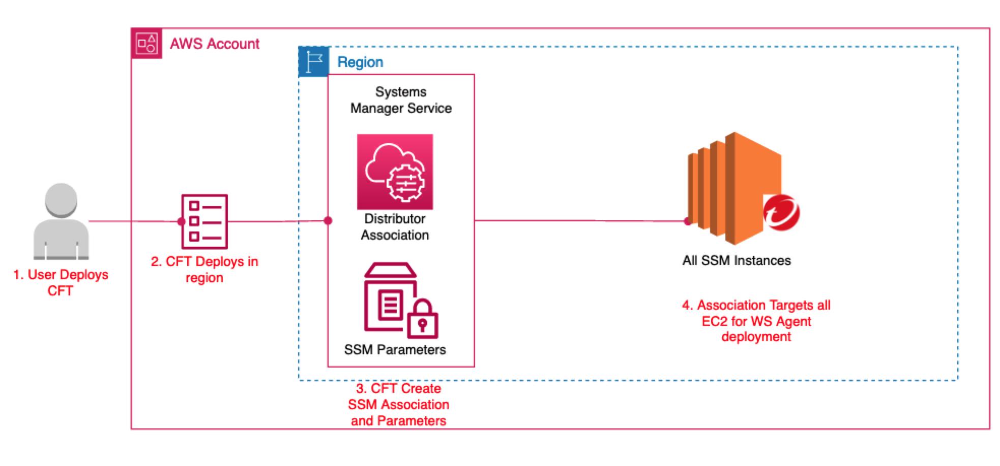

# Trend Cloud One Workload Security SSM Automation Single Account
---

AWS Systems Manager Distributor is a feature integrated with AWS Systems Manager that you can use to securely store and distribute software packages in your accounts. 
By integrating Workload Security with AWS Systems Manager Distributor, you can distribute agents across multiple platforms, control access to managed instances, and automate your deployments.

This solution will distribute Workload Security across all instances in the deployed AWS regions.



---

## Requirements

1. Download the Yaml Template named ```c1ws-ssm.template.yaml```.

2. In the Cloud One Workload Security console.
  - Click Support > Select Deployment Scripts.
  - Copy down the manager URL
  - Copy down the activation URL
  - Copy down the tenant ID
  - Copy down the token

---

## How to Deploy

To deploy the solution, launch this CloudFormation template in your organization’s management account.

1. Provide the following inputs for the template parameters:
These were copied down from the worklaod security deployment script.
  - dsActivationUrl
  - dsManagerUrl 	
  - dsTenantId
  - dsToken

2. Create the Stack.

---


